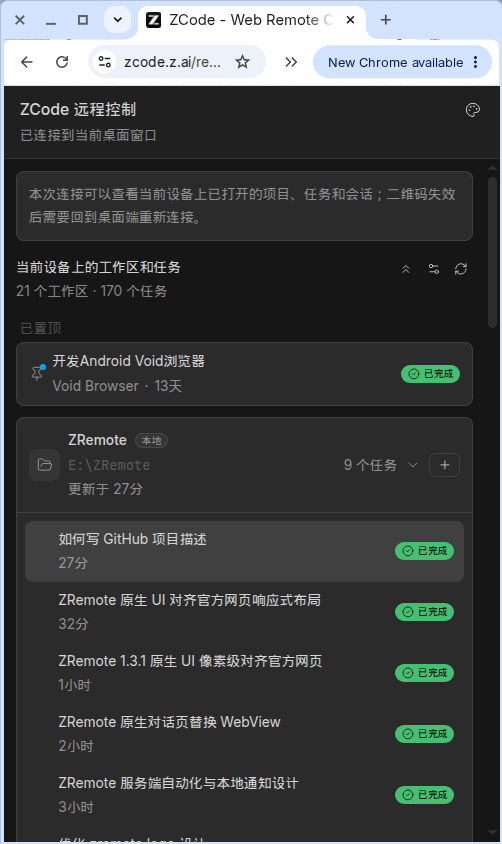
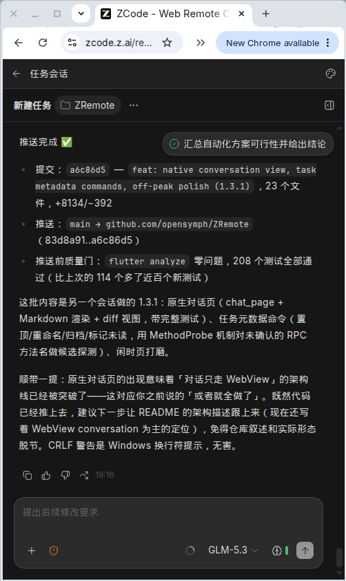
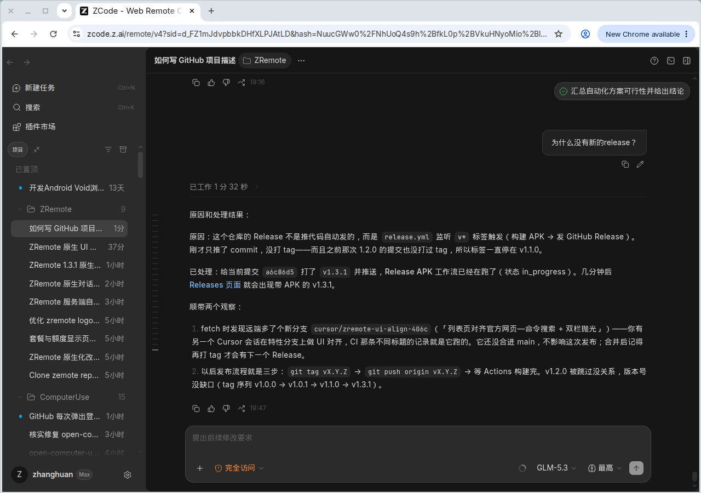

<div align="center">

# ZRemote

**全协议原生远程 —— 对话也是原生的。**

开源的 **ZCode 远程控制** —— 原生设备列表带实时在线状态与运行任务徽标,
原生任务列表支持停止 / 暂停 / 恢复,对话更是基于 Conversation V4 协议的
**全原生实现**:流式 markdown、带 diff 的工具卡片、模型/模式/思考切换、
排队消息、交互确认、附件与历史翻页。官方 Web 远程保留为随时可用的兜底。

[English](README.md) · [为什么做 ZRemote?](#-为什么做-zremote) · [功能](#-功能) · [快速开始](#-快速开始) · [架构](#-架构) · [路线图](#️-路线图)

[](https://github.com/opensymph/ZRemote/releases)
[](https://github.com/opensymph/ZRemote/actions/workflows/ci.yml)
[](https://github.com/opensymph/ZRemote/stargazers)
[](https://github.com/opensymph/ZRemote/forks)
[](#-快速开始)
[](LICENSE)
[](https://flutter.dev)
[](https://dart.dev)

</div>

---

## 💡 为什么做 ZRemote?

过去只有两个坏选项:整套复刻私有协议(relay 握手、配对证明、帧传输、V4 快照),
协议一变就碎;或者做一个纯启动器,没有状态、没有任务列表、没有任何控制。

**ZRemote 押的是混合路线。**一套经过真机验证的纯 Dart 协议栈原生驱动一切 ——
设备在线状态、实时任务列表、停止 / 暂停 / 恢复、用量、模型供应商,以及
1.3 起的完整对话体验(流式行、带 CAS 重试的命令、附件、模型切换)。官方
Web 远程保留为每个任务的逃生口;协议变动时原生路径优雅降级为网页模式,
App 照常能用。

- 🟢 **原生状态,零成本** —— 每张卡片一个在线状态点 + 运行中任务徽标,
  数据来自实时 sessions-index 订阅。
- 📋 **真正的任务列表** —— 官方移动端布局:工作区卡片(本地徽标 + 路径)、
  带状态药丸与相对时间的任务行、常显连接横幅、置顶分组、长按任务弹
  操作菜单、收起全部 / 整理 / 刷新;宽屏(≥768dp)自动切双栏,左侧
  264dp 任务栏 + 右侧内嵌对话。
- 💬 **原生对话** —— 整套 V4 能力全部组件化:分组 turn、流式 markdown、
  思考过程折叠条、带 diff 的工具摘要、交互确认、排队消息、点赞/点踩、
  重试/分叉/回滚、斜杠命令与 Skills、用量环、历史翻页 —— 外加草稿
  输入框,首条消息即建任务。
- 🧬 **协议变动砸不坏** —— 握手失败时卡片提示「请用网页版」;WebView 路径
  完全不依赖协议。设备卡还有「网页版打开」逃生口,设置里有原生列表总开关。
- 🔐 **凭据只留在手机上** —— 设备 URL 只存本地(Android 特意关闭云备份);
  没有服务器、没有埋点、没有账号。

> *该原生的原生,该官方的官方,坏了还有网页。*

觉得靠谱?给个 **Star ⭐** 持续关注。

---

## ✨ 功能

| | |
|---|---|
| 📋 **设备列表** | 卡片展示设备名 / 主机 / 上次使用时间 / 在线状态点 / 运行任务徽标;拖拽排序、置顶;重命名、删除、复制链接、浏览器打开;剪贴板提示添加;设备备份 JSON 导出 / 导入 |
| ➕ **扫码 / 粘贴 / 截图添加** | 相机扫码(`mobile_scanner`)、纯 Dart 相册识码(`zxing2`)、粘贴链接;自动去重;无法解析的链接照样保存,绝不丢 |
| 📊 **原生任务列表** | 官方移动端布局:工作区卡片(本地徽标、路径、更新时间、任务数)、带状态药丸的任务行(运行中转圈 / ✓ / 失败)、相对时间、当前任务高亮;常显连接状态横幅;置顶分组;长按任务弹底部操作菜单(停止 / 暂停 / 恢复);收起全部 / 整理 / 刷新;≥768dp 双栏(264dp 侧栏 + 内嵌对话) |
| 💬 **原生对话** | 完整 Conversation V4:分组 turn 流式 markdown、思考过程折叠、工具摘要 + diff、文件变更条(可撤销)、反馈(👍/👎/分叉)、交互确认(权限与问题)、排队消息与自动发送、模型 / 模式 / 思考 / 后续消息切换、附件、斜杠命令 + `$Skills`、用量环、上下文条、历史翻页、被接管遮罩、长按操作(重试 / 编辑重发 / 分叉 / 回滚) |
| 🆕 **草稿输入** | 工作区 ➕ 直接开新任务:先选模型/模式/思考,首条消息随 `createSession` 一起发出 |
| 🎯 **随时退回网页** | 每条任务都能从菜单进官方 Web 远程(挂起 → 注入直达 → 恢复);原生路径全程不挂起连接 |
| 📈 **用量与模型供应商** | 按设备查权益快照(剩余额度、配额限制、订阅)与管理模型供应商(工作区 bridge 上的 RPC) |
| 🤖 **服务端自动化** | 桌面端定时任务(cron / 间隔重复 / 一次性延迟)完整增删改查:人性化触发摘要、启停开关、编辑 / 删除确认;由桌面端调度进程触发,App 无需在线 |
| 🌙 **闲时任务** | 提交排队任务,在算力富余时段免费执行(Coding Plan、月度额度):排队位置(#N)实时显示、暂停 / 继续 / 取消、带时长历史、订阅/额度/不可用三态官方文案,「查看结果」直达产出会话;内置三个快捷模板 |
| 🔔 **本地通知** | 任务完成/失败、闲时结果、自动化触发推送到手机(三条可分别静音的渠道);点通知直达**原生对话** —— Web 远程的浏览器通知在手机上是收不到的 |
| ⏰ **本地定时发送** | App 内定时器 + `createSession`,到点给指定设备发消息;目标设备离线也能用,与服务端自动化互补 |
| ⚙️ **设置与关于** | 主题(深 / 浅 / 跟随系统)、语言(中文 / English)、原生列表开关、按渠道分流的检查更新、开源许可、隐私政策、本地使用统计 |
| 🌐 **应用内远程页** | 全屏 `flutter_inappwebview`,加载进度条、刷新、"在浏览器中打开"逃生口;DOM Storage 保留官方页配对状态 |
| 🎨 **官方设计 token** | 从官方 bundle 提取的中性灰阶 + 天空蓝;深色 `#161616` 默认 |
| 📱 **Android + iOS,商店就绪** | 渠道构建(`github` / `play` / `appstore`)、隐私清单、双语权限文案;任何构建都不含应用内 APK 下载 / 安装代码 |

一台设备同时只允许一个终端连接:原生对话全程保持连接(不挂起);只有
「网页版打开」会挂起它并在 WebView 关闭约 1 秒后自动重连。多台设备互不影响,
各自一条连接。

---

## 📸 截图

<p align="center">
  
  
</p>

<p align="center">
  
</p>

<p align="center">
  
</p>

手机列表 → 对话,以及 ≥768dp 的 IDE 侧栏 + 对话区。原生 UI 对齐官方远程控制布局(同一套 token、断点与结构)。

---

## 🚀 快速开始

你需要一台运行 **ZCode**(zcode.z.ai)的桌面设备。在那里生成远程链接:ZCode → 远程控制 → 二维码 / 复制链接,形如:

```text
https://zcode.z.ai/remote/v4?sid=...&hash=...&t=...&mid=...&name=...
```

### 方式 A · 下载预编译 APK

从 [Releases](https://github.com/opensymph/ZRemote/releases) 下载最新 APK,装到手机上,扫桌面二维码添加第一台设备。

> ⚠️ 请只安装你信任来源的 APK —— 远程链接等同于设备凭据。审查代码,或选择方式 B 自行构建。

### 方式 B · 源码构建

前置条件:[Flutter](https://docs.flutter.dev/get-started/install) 3.44+(Dart 3.12+)。构建 Android 需要 JDK + Android SDK;构建 iOS 需要 Mac + Xcode。

```bash
git clone https://github.com/opensymph/ZRemote.git
cd ZRemote
flutter pub get

flutter run                       # 连接真机调试

# 分发渠道(更新行为不同):
flutter build apk --release                                            # github(默认)
flutter build apk --release --dart-define=APP_CHANNEL=play             # Play 商店
flutter build ipa --dart-define=APP_CHANNEL=appstore                   # 在 Mac 上
```

「检查更新」按渠道分流:**github** 查 GitHub Releases 并跳浏览器下载;
**play** / **appstore** 直接打开商店页。任何构建都不含应用内 APK 下载 / 安装代码。

应用内:**添加设备** → 扫码或粘贴 → 点击卡片 → 原生任务列表 → 点任务 → 原生对话。

```bash
flutter analyze   # 零告警
flutter test      # 全部通过(含协议单测)
```

---

## 🧱 架构

```
┌──────────────────────────────────────────────────────────┐
│ UI (lib/ui)                                              │
│   devices_page · task_list_page · chat/ (原生对话)        │
│   automations_page · off_peak_page ·                     │
│   settings / about / usage · device_usage ·              │
│   model_providers · scheduled · qr_scan                  │
├──────────────────────────────────────────────────────────┤
│ State (lib/state)                                        │
│   device_store — 设备 + 持久化 + 备份                     │
│   device_session — 每设备连接状态机                        │
│                    (连接 / 挂起 / 恢复 / 重试,             │
│                     ChatGateway seam 供对话页)             │
│   scheduled_store — 定时消息 + 调度器                      │
│   notification_hub — 任务/闲时/自动化 → 本地通知           │
├──────────────────────────────────────────────────────────┤
│ Protocol (lib/protocol — 移植自参考实现,经真机验证)        │
│   relay_client · remote_client · conversation (V4)       │
│   channel_client · rpc_transport · ipc_codec · proof     │
│   automation · off_peak · task_commands · method_probe   │
│      (带方法名探测的 channel 端口)                         │
├──────────────────────────────────────────────────────────┤
│ Notifications (lib/notifications)                        │
│   notification_service — 三渠道 · 权限 · 点击 payload      │
│   notify_rules — 纯函数的前后快照事件推导                   │
├──────────────────────────────────────────────────────────┤
│ 网页兜底 (remote_page)                                   │
│   WebView 内的 ZCode 官方 Web 远程                         │
│   + 注入点击直达所点的会话                                 │
│   —— 归智谱所有、随官方更新,与我们无关                     │
└──────────────────────────────────────────────────────────┘
```

```text
lib/
├── main.dart                  # 入口:stores + 会话 hub + 调度器
│                              #       + 通知 hub 与点击直达
├── protocol/                  # 纯 Dart 的 ZCode 远程协议栈
│   ├── relay_client.dart      # wss relay:认证、配对、心跳、重连
│   ├── remote_client.dart     # bootstrap · bridge · 恢复 · view-state
│   ├── conversation.dart      # Conversation V4:sessions-index、命令
│   ├── channel_client.dart    # IPC channel RPC
│   ├── automation.dart        # 自动化端口(带方法名探测的 CRUD)
│   ├── off_peak.dart          # 闲时任务端口 + 错误分类
│   ├── task_commands.dart     # 任务重命名/置顶/归档/未读(带探测)
│   ├── method_probe.dart      # 逐候选试探 channel 方法名
│   ├── rpc_transport.dart     # rpc-frame 分片 + crc32
│   ├── ipc_codec.dart         # 值编解码 + 帧解析
│   ├── connection_params.dart # 远程 URL 解析 + relay ws 推导
│   ├── proof.dart · crc32.dart · device_info.dart · id.dart
├── state/
│   ├── device_store.dart      # 设备模型 + 持久化 + 导入导出
│   ├── device_session.dart    # DeviceSession + hub(每设备一个终端)
│   │                          #   + automation/off-peak host 接口
│   ├── scheduled_store.dart   # 定时消息 + MessageScheduler
│   └── notification_hub.dart  # 任务/闲时/自动化 → 本地通知
├── notifications/
│   ├── notification_service.dart # 三渠道 · 权限 · 点击 payload
│   └── notify_rules.dart         # 纯函数的前后快照事件推导
├── ui/
│   ├── theme.dart             # 官方设计 token + 深浅主题
│   ├── ui_settings.dart       # 语言 + 原生列表/通知开关 + tr() 词条
│   ├── devices_page.dart      # 设备列表(状态点 + 徽标)
│   ├── task_list_page.dart    # 原生任务列表(官方移动端布局)
│   ├── chat/chat_page.dart    # 原生对话(Conversation V4)
│   ├── chat/markdown_view.dart# markdown + 代码块(头栏 + 复制)
│   ├── chat/diff_view.dart    # 工具调用 diff 提取与渲染
│   ├── phase_pill.dart        # 共享状态药丸(列表 + turn 脚注)
│   ├── remote_page.dart       # WebView 兜底 + 直达注入
│   ├── automations_page.dart  # 服务端自动化(增删改查 + 启停)
│   ├── off_peak_page.dart     # 闲时任务(排队、额度、结果)
│   ├── settings_page.dart · about_page.dart · usage_stats_page.dart
│   ├── device_usage_page.dart · model_providers_page.dart
│   ├── scheduled_page.dart · qr_scan_page.dart
└── update/                    # 应用渠道 + GitHub release 检查
```

`lib/` 约 17,000 行 Dart,测试约 4,200 行(协议编解码、状态机、delta 应用、
存储、i18n、直达 JS 构造、自动化/闲时/任务命令端口、通知规则、基于 fake
gateway + 真 ConversationState 的对话页 widget 测试)。

---

## 🗺️ 路线图

- [x] 英文本地化(应用内中文 / English 切换)
- [x] 原生设备状态 + 运行任务徽标
- [x] 原生任务列表(停止 / 暂停 / 恢复)
- [x] 点击直达对话(WebView 注入)
- [x] 定时消息(最小自动化)
- [x] 商店就绪构建(渠道分流、隐私清单)
- [x] 服务端自动化(cron / 间隔 / 一次性,完整增删改查)
- [x] 闲时任务(排队位置、额度、查看结果直达)
- [x] 本地通知(任务 / 闲时 / 自动化三渠道 + 点击直达)
- [x] 原生对话页(V4:流式、工具、diff、排队、交互、附件、模型切换)
- [x] 官方移动端布局任务列表(工作区卡片 + 状态药丸)
- [x] README 截图 + 演示 GIF
- [x] 剪贴板检测 —— 复制远程链接后自动提示添加
- [x] 拖拽排序 + 置顶设备
- [x] 每设备 `theme=dark|light` URL 参数
- [x] 桌面快捷打开小组件(Android)
- [x] Release 工作流产出 iOS 产物(未签名 Runner.app zip)
- [x] 商店上架文案草稿 + 渠道构建(`store/play`、`store/appstore`)
- [ ] 正式提交 Play / App Store(需开发者账号 — 文案已就绪)

---

## 🤝 贡献

欢迎 Issue 和 PR。提交前请确保:

```bash
flutter analyze   # 零告警
flutter test      # 全部通过
```

小而聚焦的 PR 最快被合并。UI 改动请保持[官方设计 token](lib/ui/theme.dart) —— 这是本项目的立身之本。协议改动请保持与移植来源的参考实现一致。

---

## 🙏 致谢

- **ZCode 与官方 Web 远程** —— 协议能力与兜底体验都在那里。
- Flutter 生态:`flutter_inappwebview`、`mobile_scanner`、`zxing2`、`shared_preferences`、`url_launcher`、`web_socket_channel`、`flutter_local_notifications`、`flutter_markdown`、`file_picker`。

> ⚠️ ZRemote 是独立的社区工具,与智谱 AI 无任何隶属、背书或关联。请仅用于你自己的设备,并遵守 ZCode 服务条款。

[隐私政策](https://privacy.songsong.org/) · [服务条款](https://privacy.songsong.org/tos.html)

---

## 许可证

MIT © ZRemote contributors —— 详见 [LICENSE](LICENSE)。
